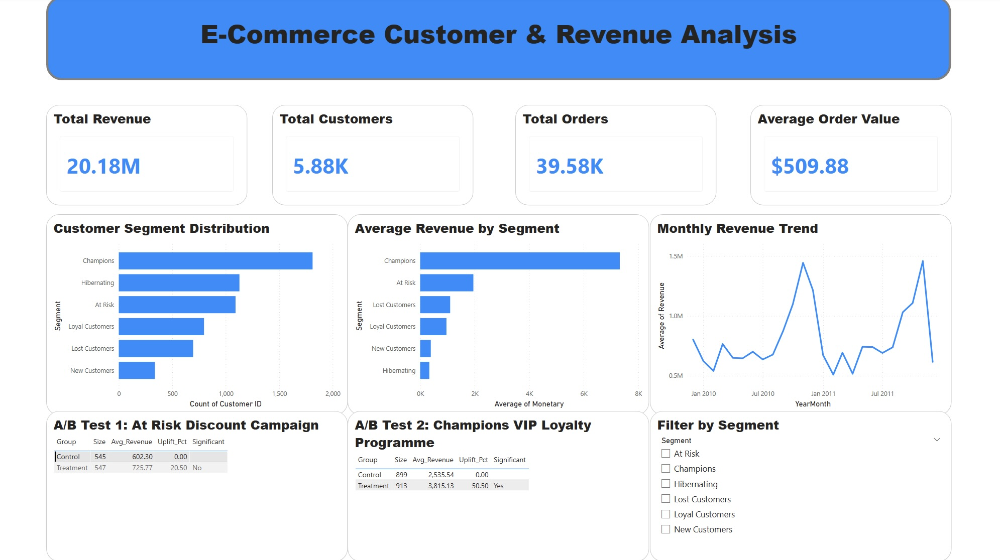

# E-Commerce Customer & Revenue Analysis

## Project Overview
Analyzed 1M+ transactions from a UK-based e-commerce retailer (2009–2011) to identify revenue decline root causes, segment customers by behaviour, and evaluate targeted promotional strategies using A/B testing.

## Business Problem
Revenue declined 4.5% from 2010 ($10.3M) to 2011 ($9.8M). This project investigates the root causes, segments customers using RFM analysis, and tests whether targeted promotions can recover at-risk customer revenue.

---

## Tools & Technologies
- Python (pandas, matplotlib, seaborn, scipy) — data cleaning, EDA, RFM analysis, A/B testing
- Power BI — interactive dashboard

## Dataset
Online Retail II UCI Dataset (Kaggle)
- 1,067,371 transactions
- 8 columns: Invoice, StockCode, Description, Quantity, InvoiceDate, Price, Customer ID, Country

---

## Key Findings

### Revenue & Market
- 85% of revenue is concentrated in the UK — high market dependency risk
- Top 3 products contribute 37% of total revenue
- Average Order Value: $509 — indicates B2B wholesale customer base
- Return rate: 2.2% — low, suggesting strong product quality

### RFM Customer Segmentation
| Segment | Customers | Avg Revenue |
|---------|-----------|-------------|
| Champions | 1,812 | $7,326 |
| Hibernating | 1,128 | $336 |
| At Risk | 1,092 | $1,952 |
| Loyal Customers | 797 | $965 |
| Lost Customers | 695 | $1,102 |
| New Customers | 338 | $391 |

### A/B Test Results

**Test 1: 10% Discount Campaign — At Risk Customers**
| Group | Size | Avg Revenue | Uplift | Significant |
|-------|------|-------------|--------|-------------|
| Control | 545 | $602.30 | — | — |
| Treatment | 547 | $725.77 | +20.5% | No (p=0.21) |

**Test 2: VIP Loyalty Programme — Champions Customers**
| Group | Size | Avg Revenue | Uplift | Significant |
|-------|------|-------------|--------|-------------|
| Control | 899 | $2,535.54 | — | — |
| Treatment | 913 | $3,815.13 | +50.5% | Yes (p=0.02) |

---

## Business Recommendations
- **Do not roll out the 10% discount** for At Risk customers — uplift of 20.5% is not statistically significant
- **Launch VIP loyalty programme** for Champions customers — 50.5% revenue uplift is statistically significant (p=0.02)
- **Diversify market beyond UK** — 85% revenue concentration creates structural risk
- If Champions VIP programme is implemented, estimated additional revenue: ~$1.3M based on current Champions base

---

## Dashboard Preview

---

## Files
- `notebooks/01_eda_cleaning.ipynb` — data cleaning and EDA
- `notebooks/02_rfm_abtest.ipynb` — RFM segmentation and A/B testing
- `exports/` — cleaned CSV files for Power BI